<!-- HERO / TITLE -->

# 👋 Hi, I'm <Your Name>
### <Your Role / Tagline>

	<a href="https://www.linkedin.com/in/<your-id>/">LinkedIn</a> •
	<a href="https://twitter.com/<your-id>">Twitter</a> •
	<a href="mailto:<your-email>">Email</a>

---

<!-- NAVIGATION -->
**👩‍💻 Introduction** • **🎓 Education** • **🛠️ Technologies** • **📌 Projects** • **🏆 Achievements** • **📫 Contact**

---

## 👩‍💻 Introduction
Hey there! I'm **<Your Name>**, a <year/role> <degree/track> student at <Institute>. I enjoy building projects in <domains> and learning <interests>.

---

## 🎓 Education
**<Degree>, <Major/Track>**  
<Institute> | <Start Year> — <Present/End Year>

---

## 🛠️ Technologies & Tools

### Languages

### Databases

### Backend

### Data Analytics

### Tools

### AI Skills

---

## 📈 GitHub Stats

---

## 📊 GitHub Activity Graph

---

## 🎯 Hobbies & Interests
- 📚 Reading tech blogs
- ♟️ Chess
- ✈️ Traveling & exploring
- 📷 Photography

---

## 📌 Projects
| Project | Description |
|--------|-------------|
| [Project One](https://github.com/<your-username>/<repo>) | Short one-line description of what it does. |
| [Project Two](https://github.com/<your-username>/<repo>) | Short one-line description of what it does. |

---

## 🏆 Achievements & Badges

---

## 🌐 Online Presence
- LinkedIn: https://www.linkedin.com/in/<your-id>/  
- Twitter: https://twitter.com/<your-id>  
- Portfolio: https://<your-domain>

---

## 📫 Contact
Feel free to reach out at <your-email> for collaboration or just a quick chat about tech.

---

## ☕ Support & Connect

---

	© 2026 <Your Name>. All rights reserved.

