<!-- HERO / TITLE -->
# 👋 Hi, I'm Anindya Bhattacharya
### B.Tech CSE (AI & ML) Student | Machine Learning | Computer Vision (YOLO) | Python

	<a href="https://www.linkedin.com/in/anindya-bhattacharya-83b68a254/">LinkedIn</a> •
	<a href="https://x.com/dev_anindya">Twitter</a> •
	<a href="mailto:anindyaholycross@gmail.com">Email</a>

---

<!-- NAVIGATION -->
**👩‍💻 Introduction** • **🎓 Education** • **🛠️ Technologies** • **📌 Achievements** • **📫 Contact**

---

## 👩‍💻 Introduction
Hi, I’m **Anindya Bhattacharya**, a **3rd-year B.Tech Computer Science & Engineering (AI & ML)** student.

I have a strong interest in **Machine Learning** and enjoy working with **Python** to analyze data, build models, and understand how intelligent systems work. I like learning through hands-on practice, experimenting with algorithms, and improving model performance using real-world datasets.

I am continuously developing my skills in **AI/ML** and looking for opportunities to learn, grow, and apply my knowledge in practical problem-solving environments.

---

## 🎓 Education
**Bachelor of Technology — B.Tech Computer Science (AIML)**  
Brainware University | Aug 2023 — Jul 2027

---

## 🛠️ Technologies & Tools

### Languages

### Databases

### Backend

### Data Analytics

### Tools

### AI Skills

---

## 📈 GitHub Stats

## 📊 GitHub Stats

---

## 📊 GitHub Activity Graph

---

## 🎯 Hobbies & Interests
- 🏸 Playing Badminton

## 🏆 Achievements & Badges

---

## 🌐 Online Presence
- LinkedIn: https://www.linkedin.com/in/anindya-bhattacharya-83b68a254/  
- Twitter: https://x.com/dev_anindya  
- Portfolio: https://dev-anindya.netlify.app/

---

## 📫 Contact
Feel free to reach out at anindyaholycross@gmail.com for collaboration or just a quick chat about tech.

---

## ☕ Support & Connect

---

	© 2026 Anindya Bhattacharya. All rights reserved.

