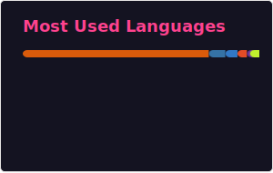

<!-- HERO / TITLE -->
# 👋 Hi, I'm Anindya Bhattacharya

### Python Backend Developer • AI Engineer • FastAPI • LangChain • LLM Applications • RAG

	<a href="https://www.linkedin.com/in/anindya-bhattacharya-83b68a254/">LinkedIn</a> •
	<a href="https://x.com/dev_anindya">Twitter</a> •
	<a href="mailto:anindyaholycross@gmail.com">Email</a> •
	<a href="https://dev-anindya.netlify.app/">Portfolio</a>

---

<!-- NAVIGATION -->
**👩‍💻 Introduction** • **🎓 Education** • **🛠️ Technologies** • **📈 GitHub Stats** • **📫 Contact**

---

## 👩‍💻 Introduction

Hi, I'm **Anindya Bhattacharya**, a **B.Tech Computer Science & Engineering (AI & ML)** student passionate about building **AI-powered backend applications**.

I primarily work with **Python**, developing scalable backend systems using **FastAPI**, integrating **Large Language Models (LLMs)**, and building **Retrieval-Augmented Generation (RAG)** applications with **LangChain** and **Vector Databases**.

I enjoy designing APIs, creating intelligent AI workflows, and deploying production-ready backend services. I'm continuously learning modern AI technologies and building projects that solve real-world problems.

---

## 🎓 Education

**Bachelor of Technology — Computer Science & Engineering (AI & ML)**  
**Brainware University**  
**CGPA:** 8.32 (Till 5th Semester)  
**Expected Graduation:** 2027

---

## 🛠️ Technologies & Tools

### Languages

### Backend

### Databases

### AI & LLM

### Deployment

### Tools

---

## 📈 GitHub Stats

---

## 📊 GitHub Activity Graph

---

## 🚀 Current Focus

- 🤖 AI-powered Backend Development
- 🧠 Large Language Model (LLM) Applications
- 📚 Retrieval-Augmented Generation (RAG)
- ⚡ FastAPI & REST API Development
- 🔍 Semantic Search & Vector Databases
- ☁️ Deploying scalable AI applications

---

## 🎯 Hobbies & Interests

- 🏸 Playing Badminton
- 📖 Exploring AI Research
- 💻 Building Backend Applications

---

## 🌐 Online Presence

- 💼 LinkedIn: https://www.linkedin.com/in/anindya-bhattacharya-83b68a254/
- 🐦 Twitter: https://x.com/dev_anindya
- 🌐 Portfolio: https://dev-anindya.netlify.app/
- 💻 GitHub: https://github.com/Anindya-Dev

---

## 📫 Contact

Feel free to reach out for collaborations, open-source projects, backend development, or AI application development.

📧 **anindyaholycross@gmail.com**

---

## ☕ Support & Connect

---

⭐ If you like my work, consider following me and checking out my repositories!

© 2026 Anindya Bhattacharya

